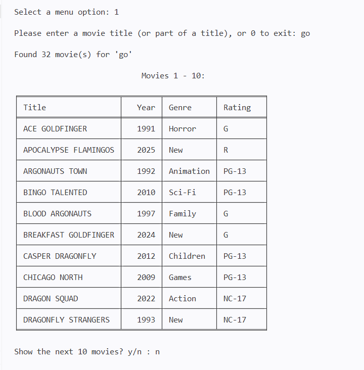
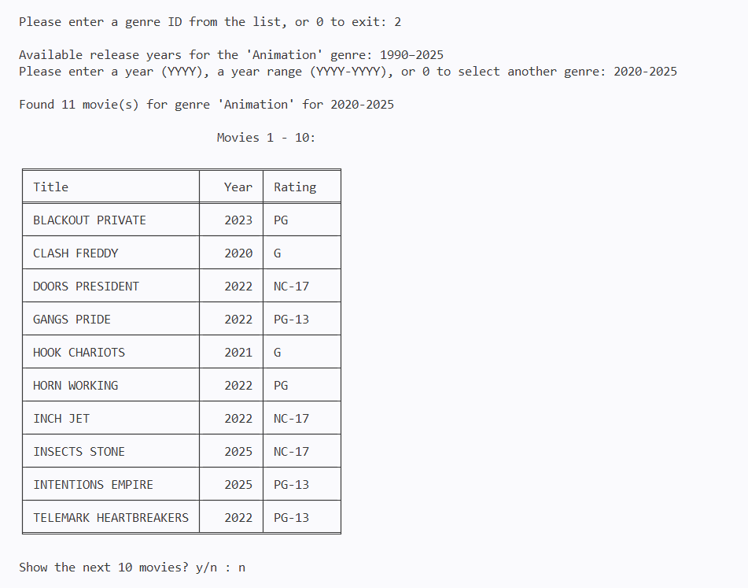
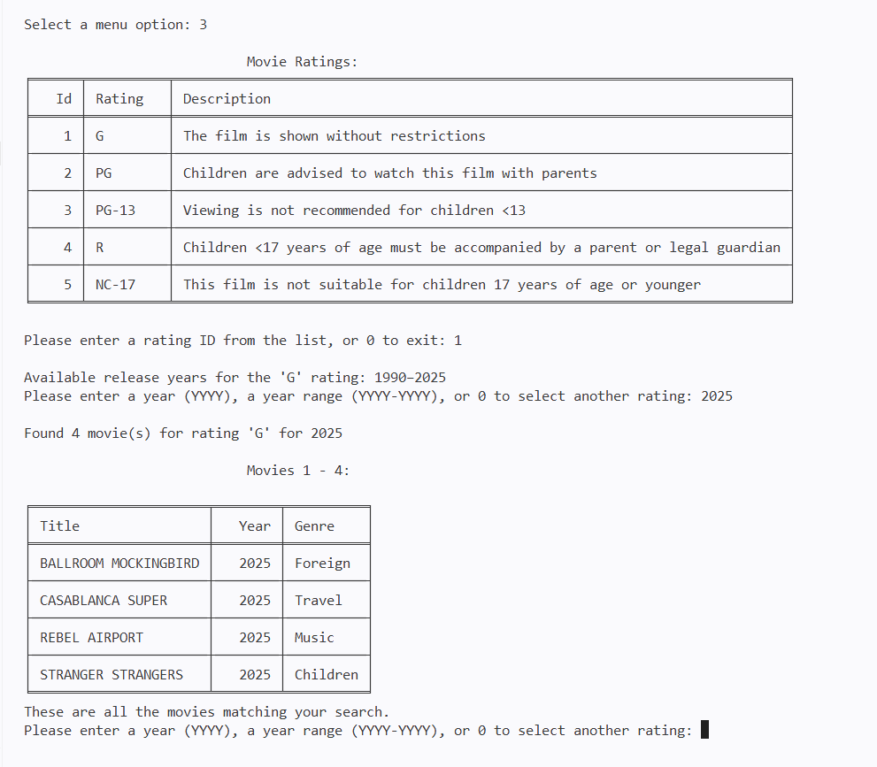
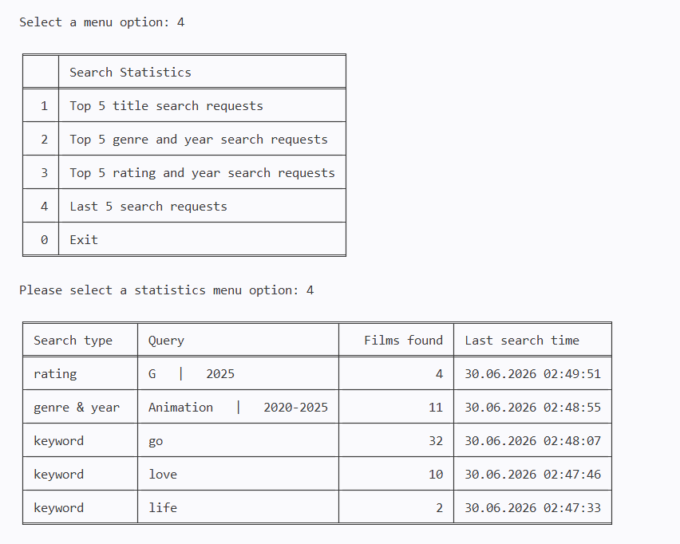

# Movie Search Console Application

A console application for searching movie data stored in a MySQL database and analyzing search requests using MongoDB.

The application allows users to search movies by title, by genre and release year, or by MPAA rating and release year. Successful search requests are stored in MongoDB and later used to generate search statistics.

The project demonstrates SQL filtering, server-side pagination, MongoDB aggregation, and a modular Python application architecture.

---

## Project Overview

The application combines a relational database for movie storage with a document-oriented database for collecting search history and generating search statistics.

Movie data is retrieved from MySQL, while successful search requests are stored in MongoDB and later aggregated to provide search analytics.

---

## Application Capabilities

The application supports three movie search scenarios and a separate search statistics section.

Users can:

- search movies by full or partial title;
- search movies by genre and release year or year range;
- search movies by MPAA rating and release year or year range;
- view the five most popular search requests for each search scenario;
- view the five most recent unique search requests.

---

## Architecture

The application follows a modular architecture where each module is responsible for a specific part of the workflow.

- **main.py** — application entry point;
- **menu_logic.py** — application workflow and user interaction;
- **MySQL.py** — movie search and SQL queries;
- **MongoDB.py** — search history and search statistics;
- **formatter.py** — console output formatting;
- **config.py** — database connection settings.

---

## Project Structure

The project is organized into independent modules, making the application easier to maintain and extend.

```text
python-mysql-mongodb-movie-search-console-app/
│
├── main.py
├── menu_logic.py
├── MySQL.py
├── MongoDB.py
├── formatter.py
├── config_example.py
├── README.md
│
└── screenshots/
    ├── title_search.png
    ├── genre_year_search.png
    ├── rating_year_search.png
    └── search_analytics.png
```

---

## Workflow

The workflow depends on the selected menu option. Movie searches are processed through MySQL, while search statistics are generated from MongoDB.

```text
                    User
                      │
                      ▼
             Select Menu Option
                      │
        ┌─────────────┴─────────────┐
        │                           │
        ▼                           ▼
   Search Movies          View Search Statistics
        │                           │
        ▼                           ▼
   Validate Input         MongoDB Aggregation
        │                           │
        ▼                           ▼
 Execute SQL Query       Display Statistics
        │
        ▼
 SQL Filtering & Pagination
        │
        ▼
Retrieve Matching Movies
        │
        ▼
 Display Results
        │
        ▼
Store Successful Search Request
      in MongoDB
```

---

## SQL Processing

Filtering and pagination are performed directly in MySQL so that only the required records are transferred to the application.

SQL processing includes:

- filtering movies by title, genre with release year, and rating with release year;
- joining movie records with their genres;
- counting unique movies using `COUNT(DISTINCT ...)`;
- combining multiple genres into a single field using `GROUP_CONCAT`;
- retrieving paginated results using `LIMIT` and `OFFSET`.

---

## MongoDB Processing

Each successful search request is stored together with its search parameters, number of matching movies, and timestamp.

Different search scenarios contain different sets of parameters. A document-oriented database allows these requests to be stored without requiring a fixed schema while keeping the data easy to aggregate and analyze.

MongoDB Aggregation Pipeline is used to generate:

- the five most popular search requests for each search scenario;
- the five most recent unique search requests.

---

## Application Preview

### Search by Title

Search movies by full or partial title with paginated results.



### Search by Genre & Year

Filter movies by genre and release year or year range with paginated results.



### Search by Rating & Year

Filter movies by MPAA rating and release year or year range with paginated results.



### Search Statistics

View recent unique search requests and aggregated search statistics.



---

## How to Run

1. Clone the repository.
2. Create a `config.py` file based on `config_example.py`.
3. Update the MySQL and MongoDB connection settings.
4. Run `main.py`.

---

## Technologies

| Category | Technology |
|-----------|------------|
| Programming Language | Python |
| Relational Database | MySQL |
| NoSQL Database | MongoDB |
| Database Libraries | PyMySQL, PyMongo |
| Console Output | tabulate |